# Ensemble Learning Priors Driven Deep Unfolding for Scalable Snapshot Compressive Imaging [PyTorch]
#### News
- **2022.07.03 :** Our paper has been accepted by ECCV 2022.
- **2022.01.25 :** Our work (https://arxiv.org/abs/2201.10419) is on arxiv.
## Abstract 
Snapshot compressive imaging (SCI) can record the 3D information by a 2D measurement and from this 2D measurement to  reconstruct the original 3D information by reconstruction algorithm. As we can see, the reconstruction algorithm plays a vital role in SCI. Recently, deep learning algorithm show its outstanding ability, outperforming the traditional algorithm. Therefore, to improve deep learning algorithm reconstruction accuracy is an inevitable topic for SCI. Besides, deep learning algorithms are usually limited by scalability, and a well trained model in general can not be applied to new systems if lacking the new training process. To address these problems, we develop the ensemble learning priors to further improve the reconstruction accuracy and propose the scalable learning to empower  deep learning the scalability just like the traditional algorithm. What's more, our algorithm has achieved the state-of-the-art results, outperforming existing algorithms. Extensive results on both simulation and real datasets demonstrate the superiority of our proposed algorithm.
# Comparison of some results


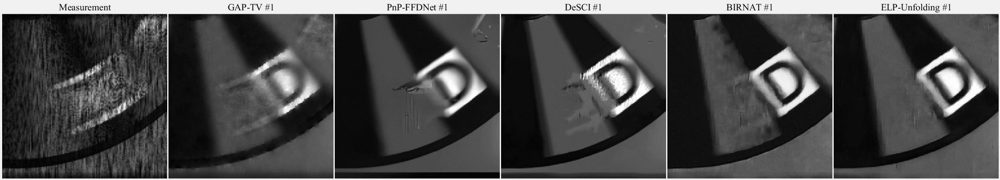
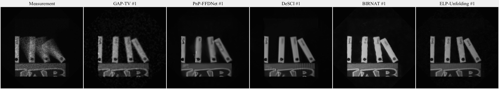
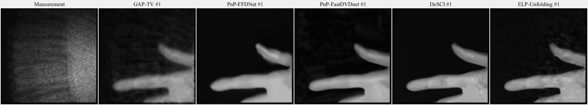
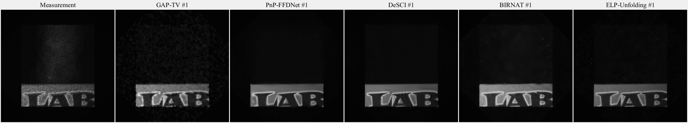

# Principle of ELP-Unfolding
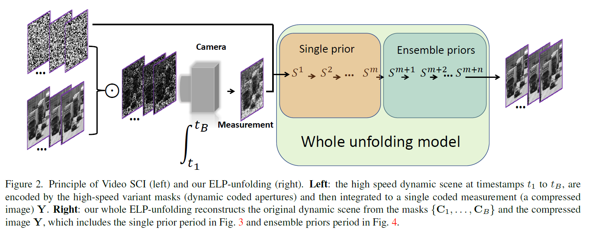
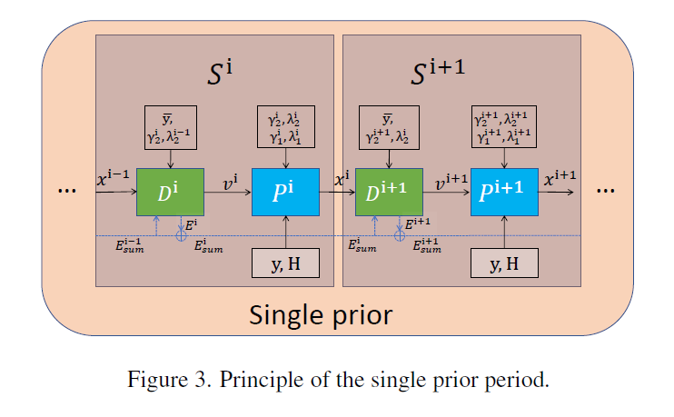
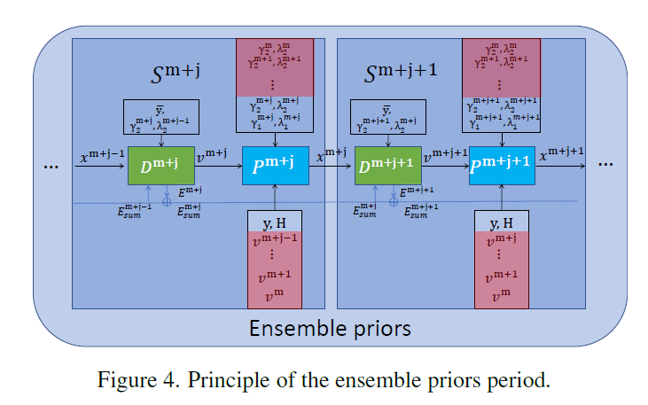
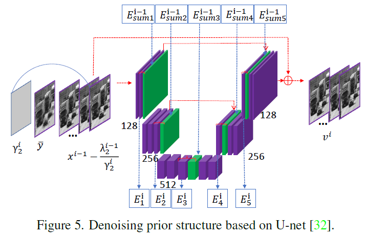


## Prerequisite

```shell
$ pip install pytorch=1.9
$ pip install tqdm
$ pip install random
$ pip install wandb
$ pip install argparse
$ pip install scipy
```
## Test
### For the Benchmark

Download our trained model from  [The file shared through the cloud drive: ckptall.pth
Link: https://pan.baidu.com/s/111cgc8aBodos8r4OoCGWPg?pwd=7y6g
Access code: 7y6g] and place it under the log_dir (your path) folder. 
```shell
cd ./ELP_Unfolding
python test.py  or  bash test.sh
```

### For the Scalable

Download our trained model from  [The file shared through the cloud drive: ckptallS.pth
Link: https://pan.baidu.com/s/1iojFLckti76use8UJUldjg?pwd=59di
Access code: 59di] and place it under the log_dir (your path)folder. 
```shell
cd ./ELP_Unfolding/scalable
python test.py  or  bash test.sh
```

## Train
Download our traineing dataset from  [The file shared through the cloud drive: traindata
Link: https://pan.baidu.com/s/12gj5OUOkB7IQ4XB71Fftlw?pwd=hwji
Access code: hwji] and place it under the traindata folder. 
### For the Benchmark
```shell
cd ./ELP_Unfolding
python train.py  or  bash tain.sh
```
The default setting is for a small memory GPU. If you want to get the same trained model with the Google Drive, the first period (pretrained) should be run
```shell
cd ./ELP_Unfolding
python train.py  --init_channels 512 --pres_channels 512 --epochs 200 --lr 1e-4 --priors 1 
```
Then the second model should be run
```shell
cd ./ELP_Unfolding
python train.py  --init_channels 512 --pres_channels 512 --epochs 320 --lr 2e-5 --priors 6 --resume_training --use_first_stage
```

### For the Scalable

```shell
cd ./ELP_Unfolding/scalable
python train.py  or  bash train.sh
```
The default setting is for a small memory GPU. If you want to get the same trained model with the Google Drive, the first period (pretrained) should be run
```shell
cd ./ELP_Unfolding/scalable
python train.py  --init_channels 512 --pres_channels 512 --epochs 200 --lr 1e-4 --priors 1 
```
Then the second model should be run
```shell
cd ./ELP_Unfolding/scalable
python train.py  --init_channels 512 --pres_channels 512 --epochs 320 --lr 2e-5 --priors 6 --resume_training --use_first_stage
```
## Results
### For Benchmark dataset

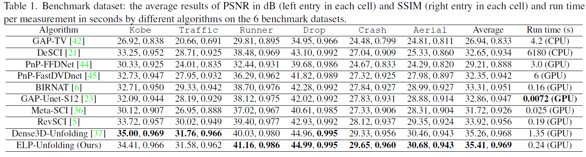

### For scalable dataset

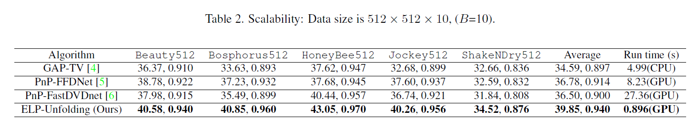
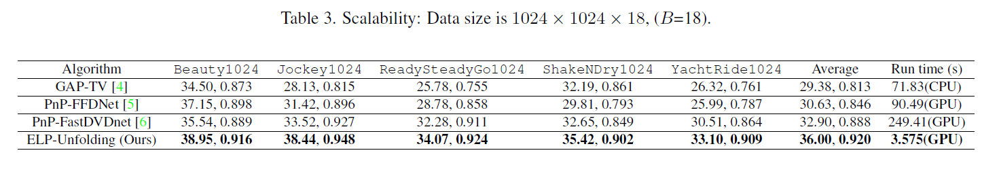

## Citation
If you find the code helpful in your resarch or work, please cite the following paper.
```
@inproceedings{,
  title={Ensemble Learning Priors Driven Deep Unfolding for Scalable Video Snapshot Compressive Imaging},
  author={Chengshuai Yang, Shiyu Zhang, Xin Yuan},
  booktitle={IEEE European Conference on Computer Vision (ECCV)},
  year={2022}
}
```
